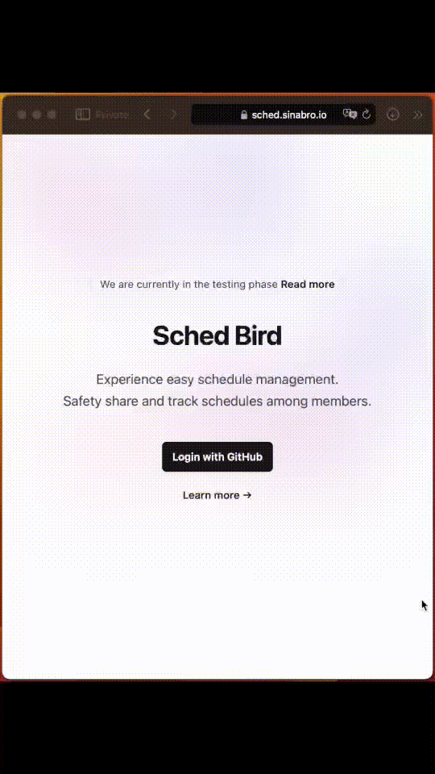

# sched-bird
Let's keep schedule sharing simple

## What is the goal of this project?
The goal is to create a complete service using only rust, except for certain layers like the database or proxy.

The following tools helped me achieve the configuration I wanted:

- Envoy Proxy
- Yew (with SSR Hydration)
- Axum
- Github OAuth
- ScyllaDB
- Tailwind CSS
- Docker Compose
- OpenAI Chat Completion

## How to work?

